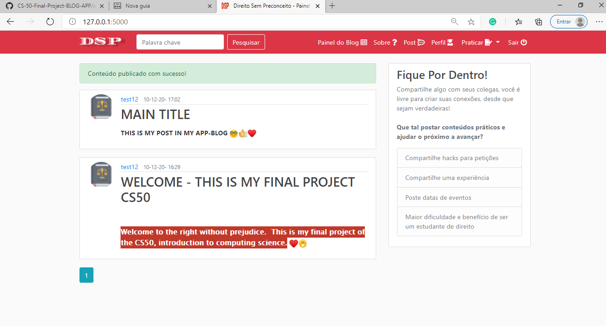
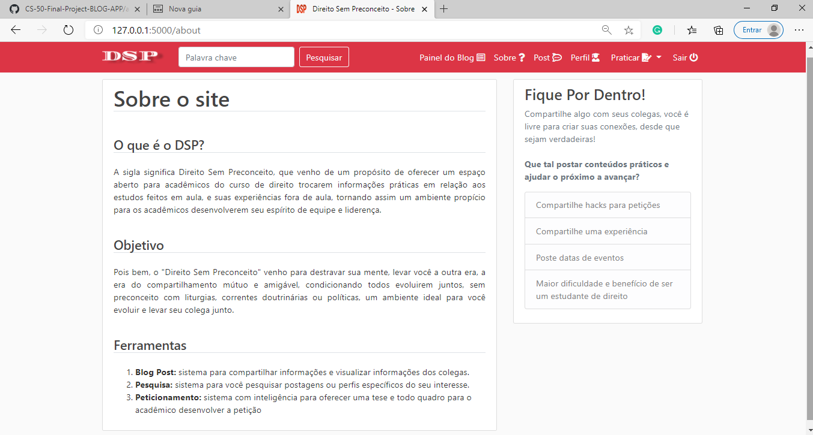
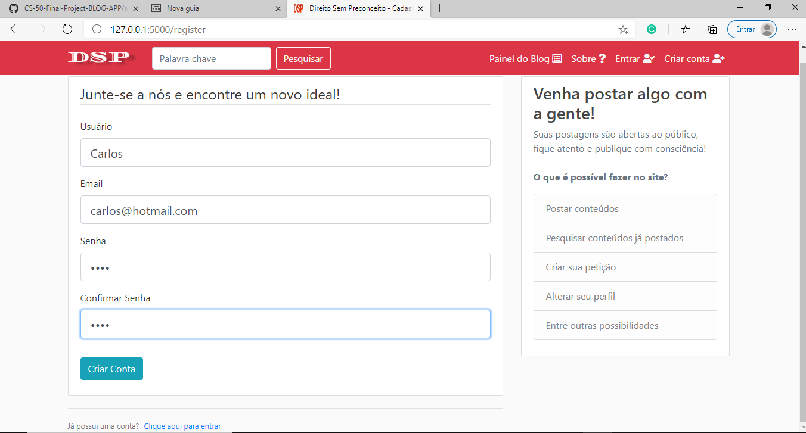
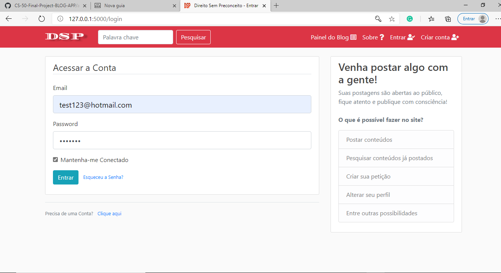
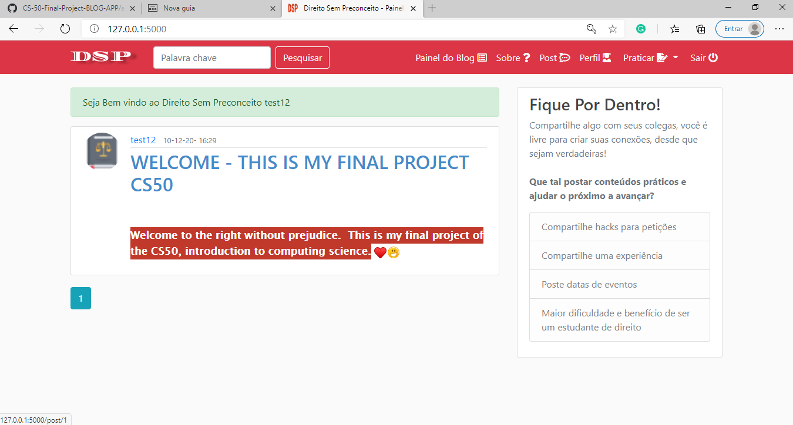
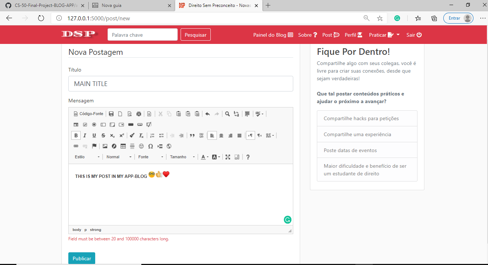
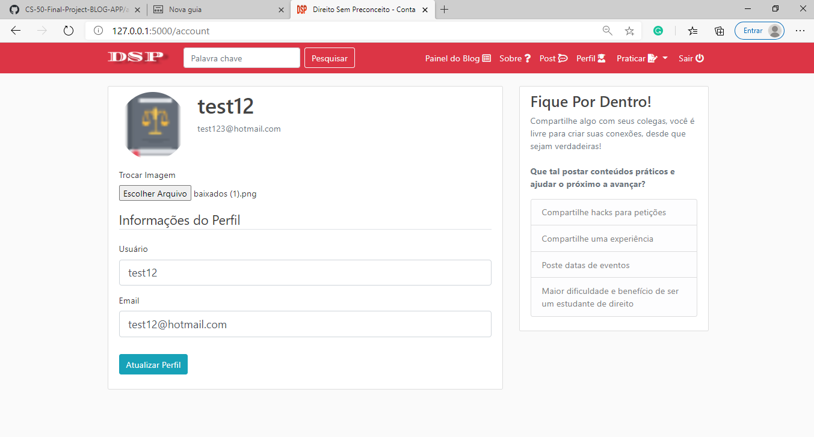
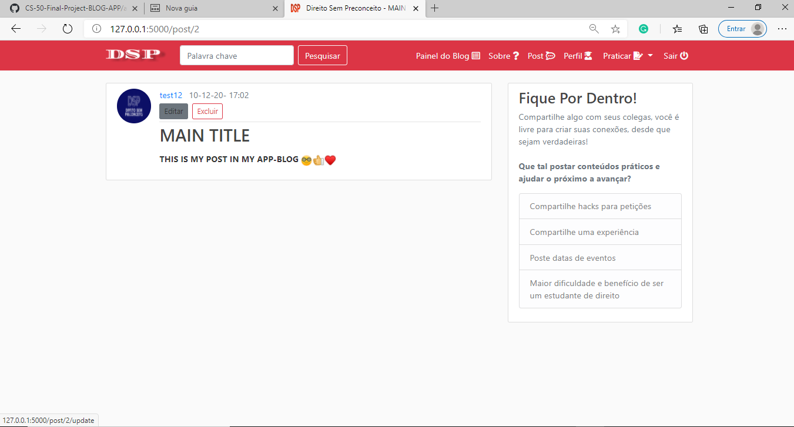
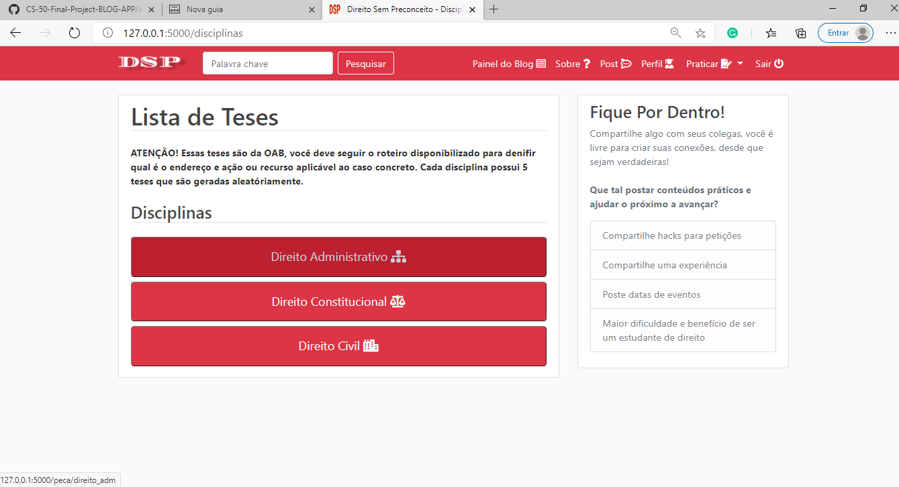
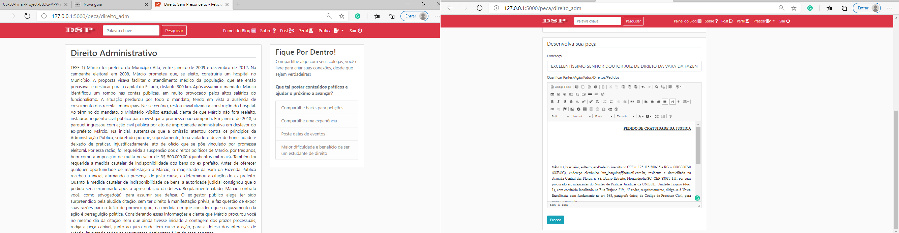

<h1 align="center">CS50 PROJETO FINAL <a  href="https://cs50.harvard.edu/x/2020/project/#:~:text=https://www.howtogeek.com/205742/how-to-record-your-windows-mac-linux-android-or-ios-screen/">CS50</a> </h1> <br>
 


<h2 align="center">
    <a href="#">🔗 Direito Sem Preconceito</a>
</h2>

# DESCRIÇÃO 

<p>Trata-se de um projeto iniciado a partir  dos estudos feitos no CS50, que tem por objtivo de integrar o direito com a programação.</p><br>


# Sobre
<p class="text-justify"> 
Blog com sistema de post e pesquisa, em que o estudande poderá criar sua conta e modficar seu perfil, fazer suas postagens e modifica-las quando quiser. 
O objetivo aqui é ajudar o acadêmico da área de direito, pois atualmente estou me formando na área e percebi uma grande falta de uma comunidade fraterna que compartilhe conhecimentos teóricos e práticos.
</p>


# Features

- [x] Cadastro de usuário
- [x] Login com troca de senha 
- [x] Sistema de Post
- [x] Sistema de alteração de Post
- [x] Sistema de Pesquisa de Post
- [x] Sistema de perfil
- [x] Sistema de alteração de perfil
- [x] Sistema de paginação
- [x] Painel único para Blog e para Estudo
- [x] Sistema de disciplinas com teses aleatórias


# Instalação
### Pré-requisitos

Antes de iniciar qualquer parte do projeto,  você vai precisar ter instalado em sua máquina as seguintes ferramentas:
[Git](https://git-scm.com)), [python.py](https://www.python.org/downloads/). 
Além disto é bom ter um editor para trabalhar com o código como [VSCode](https://code.visualstudio.com/)

### 🎲 Rodando o Back End (servidor)

```bash
# Clone este repositório
$ git clone <https://github.com/raphaelpalhano/CS-50-Final-Project-BLOG-APP>

# Acesse a pasta do projeto no terminal/cmd
$ cd CS50_final

# Vá para a pasta server
$ cd blog_app

# Instale as dependências
$ pip install flask
$ pip install flask_sqlalchemy
$ pip install flask_bcrypt
$ pip install flask_login
$ pip install flask_mail
$ pip install PIL
$ pip install wtforms 
$ pip install flask_ckeditor
$ pip install email_validator
$ pip install flask_wtf


Acessando - venv: .\CS50_final\Scripts\Activate.ps1 

Entrando no diretório: cd CS50_final; cd blog_app.

# Execute a aplicação em modo de desenvolvimento
$ python run.py

# O servidor inciará na porta:http://127.0.0.1:5000/ - 
```


# Tecnologias
<strong>As seguintes ferramentas foram usadas na construção do projeto:</strong>

- [Python](https://www.python.org/)
- [Flask](https://flask.palletsprojects.com/en/1.1.x/)
- [Github](https://github.com/)
- [Jinja](https://jinja.palletsprojects.com/en/2.10.x/templates/)
- [HTML](https://html.spec.whatwg.org/)
- [CSS-Bootsrap](https://getbootstrap.com/docs/4.5/components/alerts/)


# Demonstração da Aplicação

- <strong>PAINEL PRINCIPAL</strong>

<br><br><br>


- <strong>SOBRE</strong>

<br><br><br>


- <strong>CRIAR CONTA</strong>

<br><br><br>


- <strong>ACESSAR</strong>

<br><br><br>


- <strong>PRIMEIRO ACESSO</strong>

<br><br><br>


- <strong>POST</strong>

<br><br><br>


- <strong>EDITANDO PERFIL</strong>

<br><br><br>


- <strong>EDITANDO POST</strong>

<br><br><br>


- <strong>PRATICAR - LISTA DE DISCIPLINAS</strong>

<br><br><br>


- <strong>ATIVIDADE - DESENVOLVENDO PEÇA OAB</strong>

<br><br><br>

<p> Essa atividade está ligada totalmente a prática da OAB, em que é passado uma tese e o aluno tem que desenvolver a peça. </p>


# Contribuidores

<strong>A colaboração com o material de estudo foi imprescendível para finalização do projeto. <a  href="https://github.com/CoreyMSchafer">COREYMSCHAFER</a></strong>


# Desenvolvedor do Projeto

<strong> Raphael Angel Palhano </strong>
<p class="text-justify"> Sou estudante de direito mas amante de tecnologia. Estou desenvolvendo essa ferramenta para acadêmicos de direito melhorarem sua escrita e prática no desenvolvimento de peças </p>


